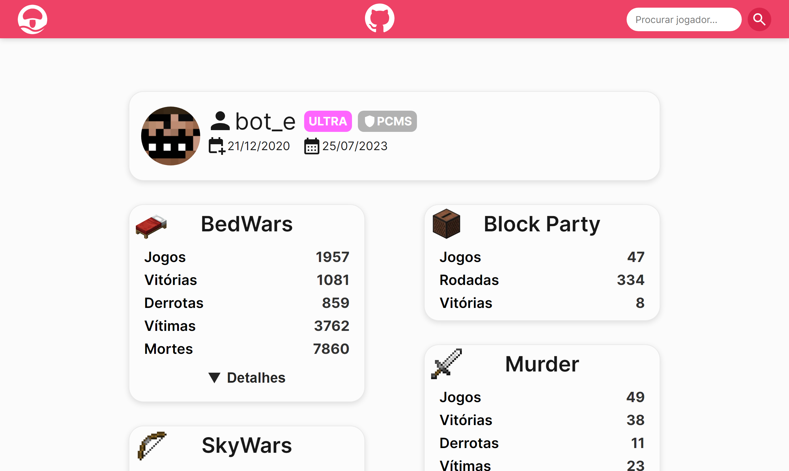
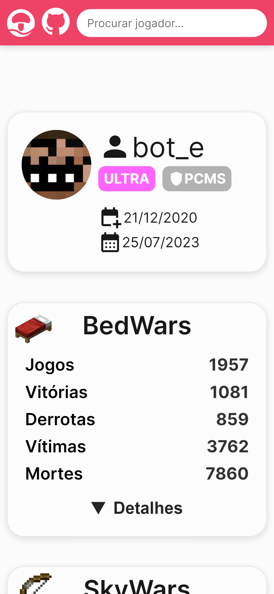

# Mush Stats

**Mush Stats** é uma ferramenta para consultar perfis de jogadores do **[Mush](https://mush.com.br)** de forma direta e amigável.

Os dados são obtidos através da API oficial do servidor, permitindo uma exibição detalhada de cada perfil.

## Contribuindo

Se você tem interesse em colaborar com o projeto dando sugestões, melhorando a estrutura ou adicionando novas funcionalidades, abra uma [Issue](https://github.com/knownasbot/mush-stats/issues) para que seja analisada.

Caso queira utilizar esse projeto para outras aplicações, sinta-se livre. Lembre-se de dar os devidos créditos e se atentar à [licença](./LICENSE).

### Preparação do ambiente

#### Requisitos

-   Git
-   Node.js

#### Inicialização

1. Crie um fork do projeto e/ou clone-o com `git clone https://github.com/knownasbot/mush-stats`
2. Instale as dependências com `npm install` na pasta do raiz do projeto
3. Rode `npm run dev` para iniciar um servidor local
4. Rode `npm run build` para publicar

Importante notar que o projeto utiliza de algumas ferramentas para manter um código legível e padronizado, como [ESLint](https://eslint.org/) (para analise sintática) e [Prettier](https://prettier.io/) (para definir alguns padrões de estilo).

Caso não utilize o editor **Visual Studio Code** e queira analisar os arquivos, use os comandos `npm run lint` e `npm run pretty`.

O projeto também faz uso do [Husky](https://typicode.github.io/husky/), então não precisa se preocupar em rodar comandos de análise sintática antes de realizar um commit.

## Demo

Para os curiosos, segue abaixo demonstrações da página.

Screenshots da página

### Desktop

### Mobile

